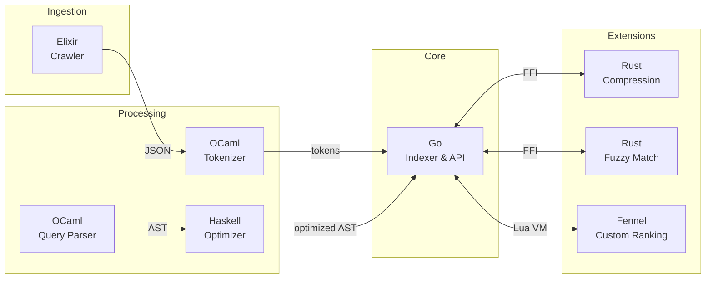

# Orange

> A search engine built from scratch — no external libraries, multiple languages, pure learning.

[]()
[]()
[](LICENSE)

## Overview

**Orange** is a polyglot search engine implementing core information retrieval concepts from scratch. Built as a deep-dive learning project, it deliberately avoids external libraries to understand the fundamentals: inverted indexes, TF-IDF ranking, stemming algorithms, query parsing, and more.

### Why This Project?

- **Learn by building** — No abstractions hiding the complexity
- **Polyglot architecture** — Each language chosen for its strengths
- **Production patterns** — Clean code, proper testing, CI/CD ready

## Architecture



## Language Responsibilities

| Language | Component | Purpose |
|----------|-----------|---------|
| **Go** | `indexer/` | Core engine, inverted index, HTTP API |
| **OCaml** | `tokenizer/` | Text processing, Porter stemmer, stopwords |
| **OCaml** | `parser/` | Query DSL, recursive descent parser |
| **Haskell** | `optimizer/` | AST rewriting, boolean simplification |
| **Rust** | `compression/` | VByte encoding, posting list compression |
| **Rust** | `fuzzy/` | Levenshtein distance, BK-tree |
| **Elixir** | `crawler/` | Distributed crawling, actor model |
| **Fennel** | `ranking/` | User-defined ranking scripts (Lisp on Lua VM) |

## Features

### Implemented

- [x] **Tokenization** — Whitespace splitting, lowercasing, position tracking
- [x] **Stopword Filtering** — ~40 common English stopwords
- [x] **Porter Stemmer** — Full 5-step algorithm implementation
- [x] **Inverted Index** — Term → PostingList with positions
- [x] **TF-IDF Ranking** — With IDF smoothing
- [x] **Query Parser** — AND, OR, NOT, phrases, grouping
- [x] **Hand-rolled JSON** — Lexer and parser from scratch

### Roadmap

- [ ] Query optimization (Haskell)
- [ ] Index persistence & compression (Rust FFI)
- [ ] HTTP server from scratch
- [ ] Fuzzy search with BK-tree
- [ ] Distributed crawler (Elixir)
- [ ] Custom ranking scripts (Fennel)

## Project Structure

```
orange/
├── tokenizer/          # OCaml - Text processing pipeline
│   ├── lib/
│   │   ├── tokenizer.ml    # Whitespace tokenization
│   │   ├── stopwords.ml    # Stopword filtering
│   │   ├── stemmer.ml      # Porter stemmer (350+ lines)
│   │   └── pipeline.ml     # Processing orchestration
│   └── bin/main.ml
│
├── parser/             # OCaml - Query DSL
│   ├── lib/
│   │   ├── token.ml        # Token types
│   │   ├── lexer.ml        # Query tokenizer
│   │   ├── ast.ml          # AST + JSON serialization
│   │   └── parser.ml       # Recursive descent parser
│   └── bin/main.ml
│
├── indexer/            # Go - Core search engine
│   ├── cmd/orange/
│   ├── internal/index/
│   │   ├── inverted.go     # Inverted index structure
│   │   └── scorer.go       # TF-IDF implementation
│   └── pkg/json/           # Hand-rolled JSON parser
│
└── Makefile            # Build orchestration
```

## Quick Start

```bash
# Build all components
make build

# Tokenize a document (stopwords removed, words stemmed)
echo "The cats are searching for food" | ./tokenizer/_build/default/bin/main.exe
# Output: [{"token": "cat", "pos": 1}, {"token": "search", "pos": 3}, {"token": "food", "pos": 5}]

# Parse a query
echo 'search AND (cat OR dog)' | ./parser/_build/default/bin/main.exe
# Output: {"type": "and", "left": {"type": "term", "value": "search"}, ...}

# Index documents and search
for f in data/*.txt; do cat "$f" | ./tokenizer/_build/default/bin/main.exe; done \
  | ./indexer/orange index hello world
```

## Technical Highlights

### Porter Stemmer (OCaml)

Hand-implemented 5-step algorithm with ~60 suffix rules:

```ocaml
let stem word =
  if String.length word <= 2 then word
  else word |> step1a |> step1b |> step1c |> step2 |> step3 |> step4 |> step5
```

- Handles edge cases like "searching" → "search", "happiness" → "happi"
- Uses measure-based thresholds to prevent over-stemming
- ~350 lines of pure OCaml

### Recursive Descent Parser (OCaml)

```ocaml
(* Grammar: query ::= term ((AND | OR) term)* *)
let rec parse_or parser =
  let left = parse_and parser in
  let rec loop left =
    if match_token parser Token.OR then
      loop (Ast.Or (left, parse_and parser))
    else left
  in loop left
```

- Supports implicit AND: `foo bar` = `foo AND bar`
- Phrase queries: `"exact match"`
- Proper operator precedence

### TF-IDF Scoring (Go)

```go
// IDF with smoothing to avoid division by zero
idf := math.Log(float64(idx.docCount+1) / float64(pl.DocFreq+1))
score := float64(posting.TermFreq) * idf
```

## Design Decisions

| Decision | Rationale |
|----------|-----------|
| **No external libraries** | Deep understanding over convenience |
| **Polyglot architecture** | Learn each language's strengths |
| **JSON for IPC** | Simple, debuggable, language-agnostic |
| **Preserved positions** | Enable future phrase query support |
| **`.mli` interface files** | Document public APIs, hide internals |

## Build Requirements

- **Go** 1.21+
- **OCaml** 4.14+ with Dune
- **Make**

```bash
# Install OCaml toolchain (Fedora)
sudo dnf install opam
opam init && opam install dune

# Install Go (Fedora)
sudo dnf install golang
```

## License

MIT — See [LICENSE](LICENSE)

---

<p align="center">
  <i>Built with curiosity, one algorithm at a time.</i>
</p>
