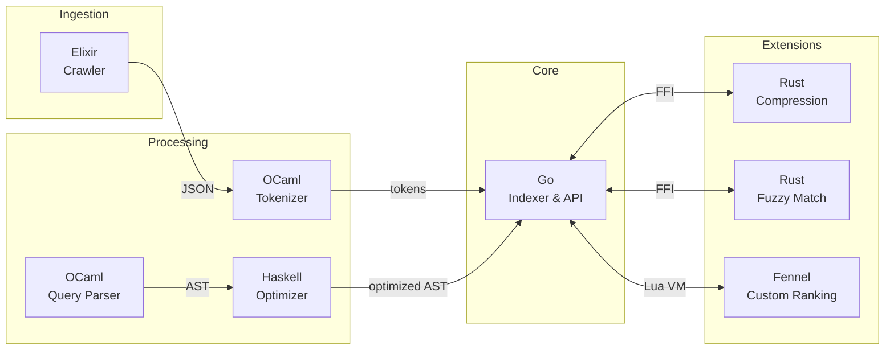

# Orange

> A search engine built from scratch — no external libraries, multiple languages, pure learning.

[](LICENSE)

## Overview

**Orange** is a polyglot search engine implementing core information retrieval concepts from scratch. Built as a deep-dive learning project, it deliberately avoids external libraries to understand the fundamentals: inverted indexes, TF-IDF ranking, stemming algorithms, query parsing, and more.

## Architecture



## Components

| Language | Component | Purpose |
|----------|-----------|---------|
| **Go** | `indexer/` | Core engine, inverted index, TF-IDF scoring |
| **OCaml** | `tokenizer/` | Text processing, Porter stemmer, stopwords |
| **OCaml** | `parser/` | Query DSL, recursive descent parser |
| **Haskell** | `optimizer/` | AST rewriting, boolean simplification |
| **Rust** | `compression/` | VByte encoding, posting list compression |
| **Rust** | `fuzzy/` | Levenshtein distance, BK-tree |
| **Elixir** | `crawler/` | Distributed crawling, actor model |
| **Fennel** | `ranking/` | User-defined ranking scripts |

## Project Structure

```
orange/
├── tokenizer/          # OCaml - Text processing pipeline
│   └── lib/
│       ├── tokenizer.ml    # Whitespace tokenization
│       ├── stopwords.ml    # Stopword filtering
│       ├── stemmer.ml      # Porter stemmer
│       └── pipeline.ml     # Processing orchestration
│
├── parser/             # OCaml - Query DSL
│   └── lib/
│       ├── token.ml        # Token types
│       ├── lexer.ml        # Query tokenizer
│       ├── ast.ml          # AST + JSON serialization
│       └── parser.ml       # Recursive descent parser
│
├── optimizer/          # Haskell - Query optimization
│   └── src/
│       ├── Ast.hs          # AST types
│       ├── JsonLexer.hs    # JSON tokenizer
│       ├── JsonParser.hs   # JSON parser
│       ├── Simplify.hs     # Boolean simplification
│       └── Emit.hs         # JSON emitter
│
├── indexer/            # Go - Core search engine
│   ├── cmd/orange/
│   ├── internal/index/
│   │   ├── inverted.go     # Inverted index structure
│   │   └── scorer.go       # TF-IDF implementation
│   └── pkg/json/           # Hand-rolled JSON parser
│
└── Makefile            # Build orchestration
```

## Quick Start

```bash
# Build all components
make build

# Tokenize a document
echo "The cats are searching for food" | ./tokenizer/_build/default/bin/main.exe
# [{"token": "cat", "pos": 1}, {"token": "search", "pos": 3}, {"token": "food", "pos": 5}]

# Parse and optimize a query
echo '(NOT (NOT hello))' | ./parser/_build/default/bin/main.exe \
  | cabal run --project-dir=optimizer orange-optimizer
# {"type": "term", "value": "hello"}

# Index documents and search
for f in data/*.txt; do cat "$f" | ./tokenizer/_build/default/bin/main.exe; done \
  | ./indexer/orange index search
```

## Build Requirements

| Tool | Version |
|------|---------|
| Go | 1.24+ |
| OCaml + Dune | 5.0+ |
| GHC + Cabal | 9.6+ |

```bash
# Fedora
sudo dnf install golang opam ghc cabal-install
opam init && opam install dune

# Build
make build
```

## License

MIT — See [LICENSE](LICENSE)
